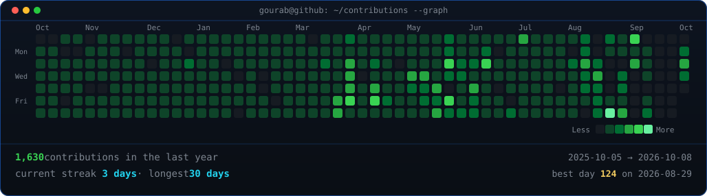
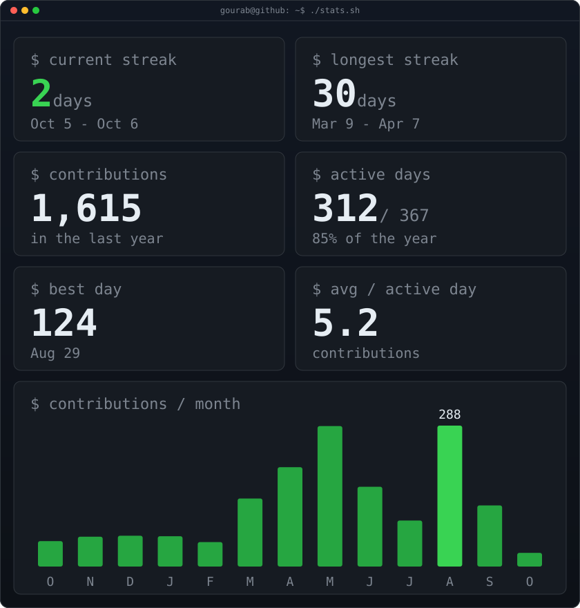

<!-- 01: contribution snake (snake.yml workflow se banta hai, output branch me) -->
<picture>
  <source media="(prefers-color-scheme: dark)" srcset="https://raw.githubusercontent.com/Gourab775/Gourab775/output/github-snake-dark.svg" />
  <source media="(prefers-color-scheme: light)" srcset="https://raw.githubusercontent.com/Gourab775/Gourab775/output/github-snake.svg" />
  
</picture>

 
 

<!-- 02: contribution graph (daily workflow se refresh hota hai, public data only) -->
<h3><code>gourab@github ~ $ ./contributions.sh</code></h3>

 
 

<!-- 03: portrait + stats (daily workflow se refresh hota hai, numbers static — koi count-up timer nahi) -->
<h3><code>gourab@github ~ $ whoami</code></h3>
<table>
<tr>
<td valign="top"></td>
<td valign="top"></td>
</tr>
</table>

 

## Gourab Neogi

Frontend developer based in Kolkata, India.

I build websites and web apps with React, Next.js and TypeScript — mostly marketing sites, e-commerce UI and dashboards. I care about layout, responsiveness and load time.

---

### Selected work

| Project | What it is | Links |
|---|---|---|
| Revolvyn Platform | Business site + owner CMS UI | [Live](https://revolvyn-site.vercel.app) · [Code](https://github.com/Gourab775/revolvyn-platform) |
| FlavorBite QR Menu | Restaurant QR ordering UI, mobile-first | [Live](https://qr-menu-app-gamma.vercel.app) · [Code](https://github.com/Gourab775/flavorbite-menu) |
| Porsche GT3 3D | Scroll-driven 3D configurator | [Live](https://vary-porsche-gt3.vercel.app) · [Code](https://github.com/Gourab775/porsche-gt3) |

<b>More builds</b>

 

| Project | What it is | Links |
|---|---|---|
| Hously Architecture | Architecture site, Next.js + Tailwind | [Code](https://github.com/Gourab775/hously-architecture) |
| Homie | Property rental UI with motion | [Code](https://github.com/Gourab775/Homie) |
| MONO | E-commerce store UI | [Code](https://github.com/Gourab775/mono-e-commerce) |

---

### Stack

TypeScript · React · Next.js · Tailwind CSS · Framer Motion · Three.js · Supabase · Vercel · Figma

---

### Elsewhere

<a href="https://github.com/Gourab775">GitHub</a> ·
<a href="https://revolvyn-site.vercel.app">Revolvyn</a> ·
<a href="https://qr-menu-app-gamma.vercel.app">FlavorBite</a> ·
<a href="https://vary-porsche-gt3.vercel.app">Porsche GT3</a>

 
Top sections refresh daily via GitHub Actions from public data. Portrait source: internet image (Unsplash).

