<!-- KEEP 01: animated contribution graph: real data, boxes reveal cell by cell
     (regenerated daily by .github/workflows/update-profile-art.yml)
     NOTE: plain , no <a> wrapper — click karne par koi repo list nahi khulta -->

<h3><code>gourab@github ~ $ ./contributions.sh</code></h3>

 
 

<!-- KEEP 02: ascii portrait (left) + streak/numbers card (right). both svgs are
     840x880 so equal widths give equal heights.
     portrait: python scripts/fetch_portrait.py && python scripts/make_ascii_svg.py
     stats:    python scripts/render_stats_svg.py (same daily workflow) -->

<h3><code>gourab@github ~ $ whoami</code></h3>

<table>
<tr>
<td valign="top"></td>
<td valign="top"></td>
</tr>
</table>

 

<!-- NEW: premium animated hero (self-hosted SVG: floating orbs, shine bar, blinking cursor, floating pills) -->

 
 

<!-- NEW: smooth typing animation — frontend positioning -->

<h1>Hey, I'm Gourab Neogi 👋</h1>

<b>Frontend Web Designer & Developer — Kolkata, India</b>

I design & build <b>premium, fast, responsive</b> websites — landing pages, e-commerce UI, dashboards & 3D web experiences. Clean layout. Smooth animation. Mobile-first. SEO-ready.

 
 

<h3><code>gourab@github ~ $ ./frontend-stack.sh</code></h3>

<!-- NEW: infinite scrolling tech ticker (self-hosted animated SVG) -->

 

 

 
 

<h3><code>gourab@github ~ $ ./featured-builds.sh</code></h3>

Live frontend builds — design, responsiveness & motion pe focus. Code public hai, activity me repo-wise detail nahi dikhata.

<table>
<tr>
<td width="50%" valign="top">

<b>🌐 Revolvyn Platform</b> 
Business site + Owner CMS UI · Clean marketing layout  
Next.js · Tailwind · Neon · Clerk  

</td>
<td width="50%" valign="top">

<b>🍔 FlavorBite QR Menu</b> 
Restaurant QR ordering UI · Mobile-first UX  
React · Vite · Supabase · Tailwind  

</td>
</tr>
<tr>
<td width="50%" valign="top">

<b>🏎️ Porsche GT3 3D</b> 
Scroll-driven 3D configurator · Cinematic motion  
React · Three.js · R3F / Drei  

</td>
<td width="50%" valign="top">

<b>🏠 Hously Architecture</b> 
Modern architecture site · Premium grid + motion  
Next.js 16 · Tailwind v4 · shadcn/ui  

</td>
</tr>
</table>

<table>
<tr>
<td width="50%" valign="top">

<b>🏡 Homie — Rental Platform</b> 
Animated property UI · Framer Motion 

</td>
<td width="50%" valign="top">

<b>🛍️ MONO E-commerce</b> 
Sustainable store UI · Next.js 16 + shadcn 

</td>
</tr>
</table>

 

<h3><code>gourab@github ~ $ ./ui-craft.sh</code></h3>

<table>
<tr>
<td align="center" width="25%"><b>🎯 Pixel-Perfect</b> Figma to code Clean grids Design system</td>
<td align="center" width="25%"><b>📱 Responsive-First</b> Mobile → Desktop Fluid type Touch-friendly</td>
<td align="center" width="25%"><b>✨ Motion & Micro-interactions</b> Smooth scroll Hover states Page transitions</td>
<td align="center" width="25%"><b>⚡ Fast & SEO</b> Core Web Vitals Semantic HTML Meta + OG</td>
</tr>
</table>

 

<h3><code>gourab@github ~ $ ./links.sh</code></h3>

 

 

Top 2 sections auto-refresh daily via GitHub Actions — no token, no third-party stats service for graphs. Portrait source: internet image (Unsplash). Koi repo delete nahi kiya gaya — sirf README design update hai.

 

